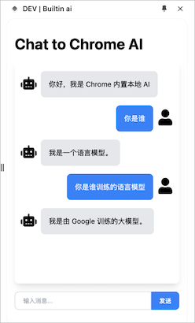
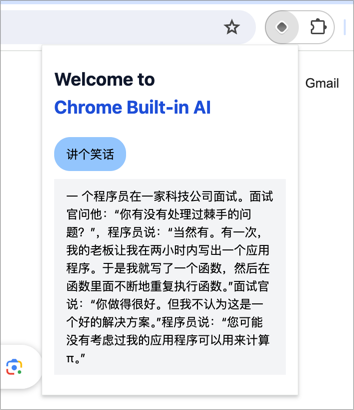

# Explore Chrome Built-in AI

ref https://developer.chrome.com/docs/ai/built-in

Now only have "tell me a joke" function.




## Enable AI in Chrome

Make a demo using chrome built-in Gemini Nano. Need chrome version > v127.x, now in [Dev](https://www.google.com/chrome/dev/?platform=mac&extra=devchannel) or [Canary](https://www.google.com/chrome/canary/?platform=mac) channel, [may release on stable chanel at Jun 17, 2024](https://chromestatus.com/roadmap), if release schedule on time. 

After install AI built-in chrome version, NEED turn on these flags:

- chrome://flags/#prompt-api-for-gemini-nano
- chrome://flags/#optimization-guide-on-device-model

Then click `Optimization Guide On Device Model` in chrome://components/ to download model.

Finally, you could play AI API in dev console, or install this extension built by this repo.

## Dev Setup

First, run the development server:

```bash
pnpm dev # run dev environment
```

For further guidance, [visit plasmo Documentation](https://docs.plasmo.com/)

## Current API Schema

Keep exploring...

```
window.ai
- canCreateGenericSession(): boolean
- canCreateTextSession(): boolean
- createGenericSession(): AITextSession
- createTextSession(): AITextSession
- defaultGenericSessionOptions: {}
- defaultTextSessionOptions: {}

AITextSession {
  execute(text: string): ...
  executeStreaming(text: string): ...
  prompt(text: string): string
  promptStreaming(text: string): ...
  destroy(): void
}

```
